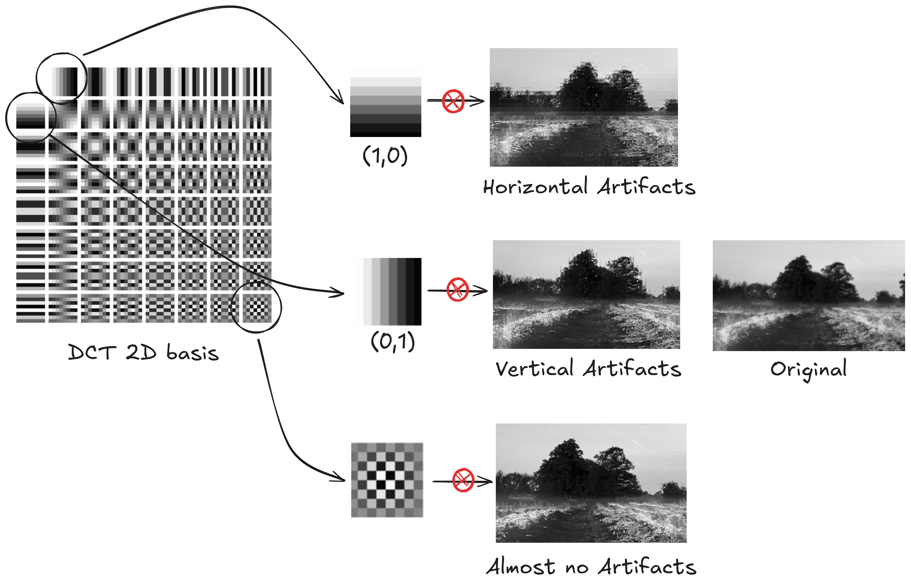
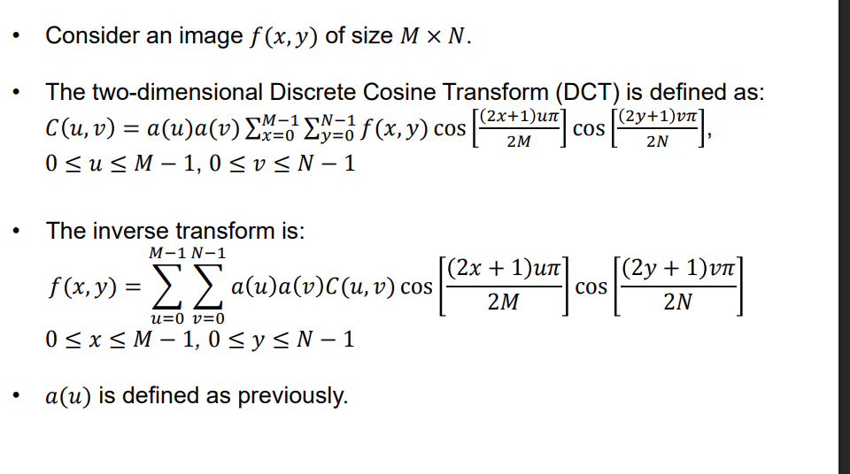

# DCT implementation in C



Even modern image compression starts from a very human flaw: our eyes are just not that great at noticing high-frequency details.  
That’s why formats like JPEG first perform a **change of basis**, moving from the *pixel intensity* domain to the *frequency* domain using the **Discrete Cosine Transform (DCT)**.

Once an image is expressed in terms of frequencies, interesting things happen. Low frequencies capture the overall structure, while high frequencies mostly encode fine details. Compression algorithms usually exploit this by discarding or quantizing the high-frequency stuff, saving several bytes.

⚠️ **Important note:** this repository does **not** implement image compression. There’s no entropy coding, quantization tables, or bitstream wizardry here. The focus is purely on the **DCT itself and its low-level implementation in C**.

## What happens here?

- The image is split into **8×8 blocks** (just like JPEG does).
- A **forward DCT** is applied to each block, changing the basis from pixel values to frequency coefficients.
- (Optionally) you can manually zero out some frequency bins to see what information loss looks like.
- A **reverse (inverse) DCT** is applied to reconstruct the image back in the spatial domain.

This repo is a **toy example** meant to show how forward and backward DCTs can be written from scratch, with minimal abstractions and maximum transparency. You’re encouraged to poke around, throw away different frequencies, and visually inspect how the reconstructed image changes as a result.

Just for reference, these are the formulas I used to encode (and decode) each 8x8 block:



## Build & run

```bash
gcc main.c pam.c
./a.exe grayscale.pam
```
Open ```restored.pam``` and look at the difference from the original image!